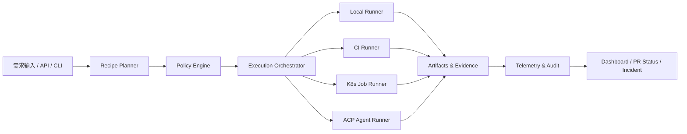

# 工业前端 Harness v1 架构设计说明书

## 1. 文档目标

本文档用于定义工业前端 Harness v1 的架构基线，指导一期实现、试点接入与后续演进。

## 2. 一期建设目标
- 建立统一 Task / Adapter / Runner / Policy / Recipe / Telemetry 抽象
- 打通 Git + CI + Playwright + PR + Evidence 基础闭环
- 建立 canary / rollback 能力
- 支撑 1–2 个真实项目试点

## 3. 非目标
- 不在一期做完整 Portal
- 不在一期统一所有组件库
- 不在一期覆盖所有业务系统
- 不在一期替换现有 CI、监控或制品库

## 4. 架构原则
- Spec First
- PR First
- Evidence First
- Rollback First
- Policy First
- Composable

## 5. 总体架构

## 6. 核心模块

| 模块 | 职责 | 说明 |
|---|---|---|
| Planner | 将输入解析为 Recipe Plan | 支持 dry-run / graph 展示 / input 校验 |
| Policy Engine | 执行门禁规则与审批要求 | 在执行前、执行中和 Promote 前都可触发 |
| Execution Orchestrator | 调度 Task DAG | 负责 depends_on、失败策略、重试与并发限制 |
| Runners | 执行任务 | 本地、CI、K8s、ACP 等执行环境实现 |
| Adapters | 封装外部系统 | Git、Issue、Browser、Telemetry、Deploy、FeatureFlag |
| Evidence Store | 归档报告与执行证据 | html report、trace、截图、构建产物、PR 链接、制品 hash |
| Telemetry & Audit | 记录日志、指标、审计事件 | 贯穿 run_id、recipe_id、git_sha、artifact_hash |

## 7. 一期技术选型建议
- TypeScript
- Node.js
- Monorepo
- Playwright
- Vitest / Jest
- OpenTelemetry

## 8. 一期范围建议
### 必做
- CLI
- Spec Loader
- Planner
- Policy Engine
- DAG Orchestrator
- local / ci / acp-agent 三类 runner
- Git Adapter
- Playwright Test Task
- Evidence Store
- OTel 基础埋点
- 回滚 Recipe

### 可后置
- Portal
- 多租户
- 高级 Dashboard
- 大规模资产目录
- 复杂审批中心
- 自动化灰度分批平台
